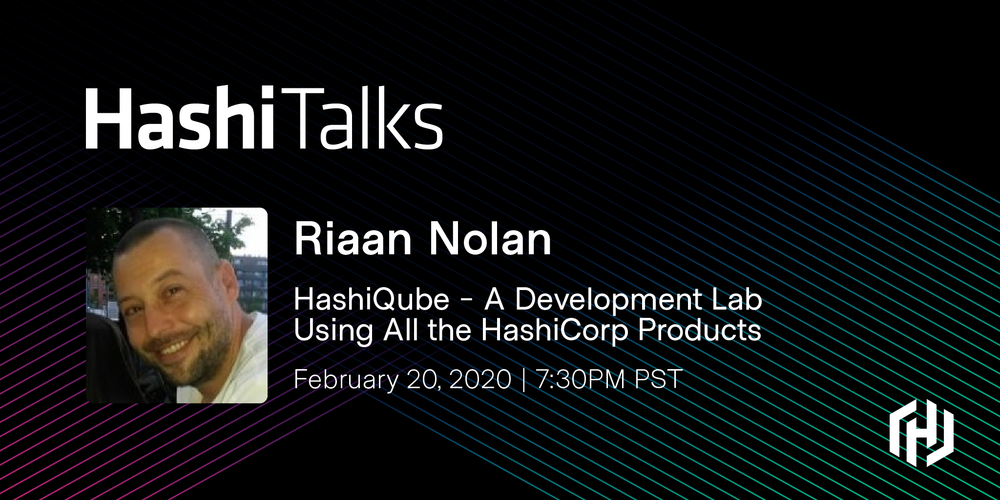

# Riaan Nolan
curious /ˈkjʊərɪəs/ eager to know or learn something

## About

Welcome to my website :heart: My name is __Riaan Nolan__ and I am a DevOps engineer.
I have previously worked for Multi-National companies in Portugal, Germany, China, South Africa, the United States and Australia, with remote teams across the globe.

I started out as a Systems Administrator and from there progressed into DevOps with a strong focus on  __Cloud Computing__, __Infrastructure as Code__ and __Deployment Pipelines__.

## Projects
__HashiQube__ <a href="https://hashiqube.com" target="_blank">https://hashiqube.com</a> A Development Lab running All HashiCorp products 
__RubiksQube__ <a href="https://rubiksqube.com" target="_blank">https://rubiksqube.com</a> A Development Lab running a lot of stuff 

### Tags
__Clouds__ `AWS` `GCP` `Azure`  
__CI/CD__ `Jenkins` `Travis` `GitLab` `AWS Code Deploy` `Capistrano`  
__HashiCorp__ `HashiQube` `Terraform` `Vagrant` `Packer` `Vault` `Consul` `Nomad` `Sentinel`  
__AWS__ `EC2` `RDS` `Route53` `ElastiCache` `Redshift` `Billing` `Cost Saving` `Cloudfront` `SNS` `SQS` `Cloudformation`  
__Elastic__ `Elasticsearch` `Logstash` `Kibana` `Filebeat` `Metricbeat` `Cerebro` `ElastAlert`  
__Misc__ `Cloudflare` `Git` `Linux` `Docker` `Ngrok` `Puppet` `Hiera`

#### Links
__Linkedin__ <a href="https://www.linkedin.com/in/riaannolan/" target="_blank">linkedin.com/in/riaannolan</a>  
__Twitter__ <a href="https://twitter.com/riaannolan" target="_blank">twitter.com/riaannolan</a>

##### HashiTalks 2020

 
